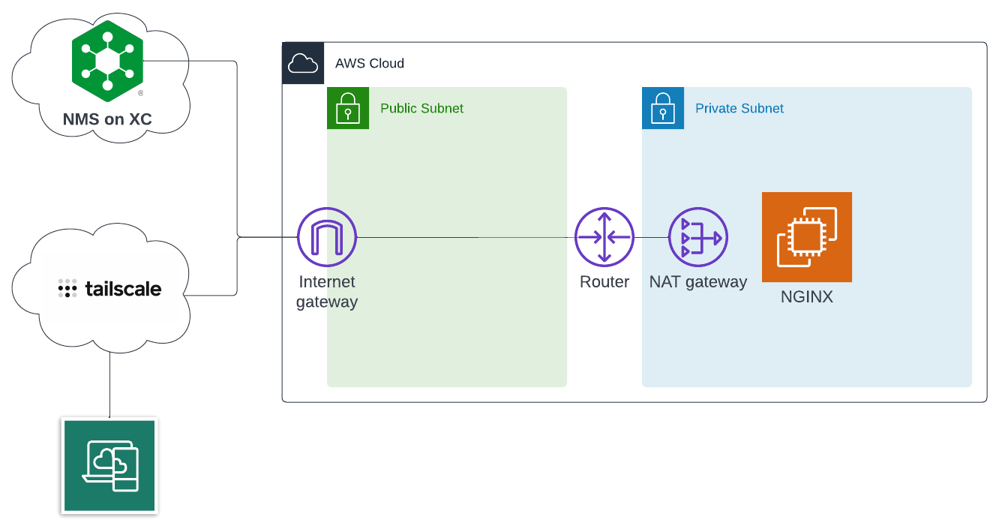

# NMS on XC Demo Resources

Deploy NGINX Plus resources into AWS to demo NMS on XC

> Note: NMS on XC is in early preview so not all resources will be publicly available.
> Note: This deployment leverages [Tailscale](https://tailscale.com/) to connect into the EC2 instances.



## Deployment

> Note: You will need to save your *nginx-repo.crt* and *nginx-repo.key* in the base folder of this project.

Run the following Terraform commands to deploy the environment:

```bash
terraform init
terraform apply -auto-approve
```

## Install NGINX Agent

Follow the NMS on XC early access documentation on how to install and configure the NGINX Agent.
